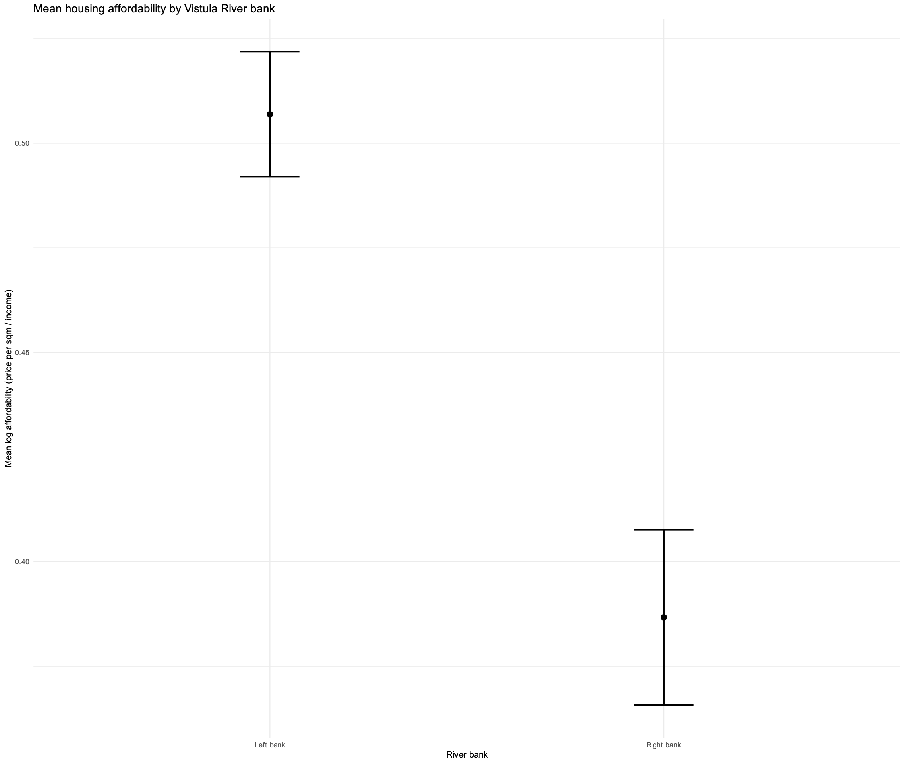
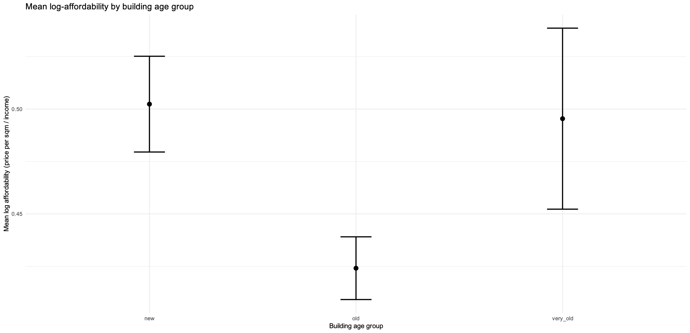

<center>

# Affordability of Residential Real Estate in Warsaw

---

**R-Bootcamp Project – W.MSCIDS_RB01.H2501**

Alena Ploshchansky · Rita Ahlborn

*Master of Science in Real Estate*

*Minor in Data Science*

Lucerne University of Applied Sciences and Arts

January 28, 2026


</center>

```{css, echo=FALSE}
p {
  text-align: justify;
}

center p {
  text-align: center;}
```

---

{width=100%}

---

```{r setup, include=FALSE}
knitr::opts_knit$set(root.dir = ".")
```

## **1. Introduction and Hypothesis**


### 1.1 Background and purpose of the project


---


## **2. Data Description**
Sources and types of data will be explained here. how many columns/rows, what kind of variables, etc.

```{r libraries, include = FALSE}
# Load required libraries
# Here maybe we should separate libtraries based on usage
library(dplyr)
library(ggplot2)
library(tidyr)
library(readxl)
library(janitor)
library(stringi)
library(stringr)
library(tidygeocoder)
library(writexl)
library(readr)

# Libraries for R markdown
library(knitr)
library(kableExtra)
library(rmarkdown)

# Libraries for visualizations
library(RColorBrewer)
library(scales)

# Libraries for maps
library(ggmap)
library(sf)
library(rlang)

# To be updated ...
```


```{r data, include = FALSE}
#### Data set ####
## load data and inspection

## Prices data set
prices <- read_excel("Prices.xlsx")
head(prices)
dim(prices)

## Density data set
density <- read_excel("Density.xlsx", sheet="TABLE")
head(density)
dim(density)

## Median wage data set
median_wage <- read_excel("MedianWage.xlsx", sheet="TABLE")
head(median_wage)
dim(median_wage)

## Data check
glimpse(prices)
glimpse(density)
glimpse(median_wage)

```

---


## **3. Data Preparation**
In this chapter we describe the datasets we have as well as prepare it for further
analysis. We clean it, transform it and merge it into one final dataset.


### 3.1 Data Cleaning and transformation
This chapter is dedicated to cleaning and transforming each dataset separately.
After all the manipulations we will have three clean datasets ready for merging.
We will merge them in this chapter as well.
We have 3 datasets: prices, density, median_wage.

#### *3.1.1 Price Data*
Here we check for missing values and clean the data. We remove columns that are not needed.

```{r prices_values, include = FALSE}
## Check for missing values
sum(is.na(prices))
## Remove and change polish letters, convert to lower case
clean_prices <- prices %>%
  clean_names() %>%
  mutate(across(where(is.character),
            ~ tolower(stri_trans_general(., "Latin-ASCII"))))

## Check cleaned data
glimpse(clean_prices)

## Remove unnecessary columns
clean_prices <- clean_prices %>%
  select(-c("zrodlo_informacji", "cena_wartosc", "waluta", "numer_budynku"))

```
Here we create new variables: price per sqm, log price per sqm, etc.
First is geo data
```{r prices_geo, include = FALSE}
## Coordinates data type conversion and save
if (!file.exists("streets_geo.rds")) {

  streets_geo <- clean_prices %>%
    distinct(ulica) %>%
    mutate(address = paste0(ulica, ", Warsaw, Poland")) %>%
    geocode(
      address = address,
      method = "osm",
      lat = latitude,
      long = longitude
    )

  saveRDS(streets_geo, "streets_geo.rds")
}

# Load saved geo data
streets_geo <- readRDS("streets_geo.rds")

clean_prices <- clean_prices %>%
  left_join(streets_geo, by = "ulica")
```


```{r prices_cleaning, include = FALSE}

## Remove unnecessary columns
clean_prices <- clean_prices %>%
select(-address)

## Check final price data for missing values
sum(is.na(clean_prices))
glimpse(clean_prices)

## Delete rows with missing coordinates
clean_prices <- clean_prices %>%
filter(!is.na(latitude) & !is.na(longitude))
```

```{r prices_age, include = FALSE}
## Create building age groups
clean_prices <- clean_prices %>%
mutate(
building_age_group = case_when(
rok_budowy < 1960 ~ "very_old",
rok_budowy >= 1960 & rok_budowy < 2010 ~ "old",
rok_budowy >= 2010 & rok_budowy <= 2025 ~ "new",
TRUE ~ NA_character_))
```

```{r prices_date, include = FALSE}
## Date conversion
clean_prices <- clean_prices %>%
mutate(quarter_only = str_extract(data_transakcji_wyceny, "q[1-4]")) %>% # we left quarter only as all the data is from 2025
select(-data_transakcji_wyceny)
```

```{r prices_price_sqm, include = FALSE}
clean_prices <- clean_prices %>%
relocate(quarter_only, .before = cena_wartosc_1m2) %>%
mutate(log_price_sqm = log(cena_wartosc_1m2)) %>%
relocate(log_price_sqm, .after = cena_wartosc_1m2)
```

#### *3.1.2 Wage Data*
Here we clean the wage data set and convert it to quarterly median wage.

``` {r wage_cleaning, include = FALSE}
# Removing missing Values and unnecessary columns

clean_wage <- median_wage %>%
select(-Code, -Name) %>%
slice(-c(1, 2, 3, 4))

#Wide to Long
clean_wage <- clean_wage %>%
pivot_longer(
cols = everything(),
names_to = "month",
values_to = "median_wage"
) %>%
mutate(median_wage = readr::parse_number(median_wage))
```

``` {r wage_quarter, include = FALSE}
# Convert wage median to quarterly median
wage_quarterly <- clean_wage %>%
mutate(
quarter = case_when(
month %in% c("January", "February", "March") ~ "q1",
month %in% c("April", "May", "June")         ~ "q2",
month %in% c("July", "August", "September")  ~ "q3",))
wage_quarterly <- wage_quarterly %>%
group_by(quarter) %>%
summarise(
median_wage_q = mean(median_wage, na.rm = TRUE),
.groups = "drop")
```

``` {r wage_log, include = FALSE}
# Add log median wage quarterly
wage_quarterly <- wage_quarterly %>%
mutate(log_median_wage_q = log(median_wage_q))
```

#### *3.1.3 Density Data*

Here we will explain cleaning steps for Density data set.

``` {r density_cleaning, include = FALSE}
# Clean Density data set
# Cleaning the Polish letters and NAs from Density data set

clean_density <- density %>%
clean_names() %>%
select(-code) %>%
mutate(across(where(is.character),
~ tolower(stri_trans_general(., "Latin-ASCII"))))%>%

# remove missing values
na.omit()

# Erase first 2 rows and Distric 8 from the name
clean_density <- clean_density %>%
slice(-c(1, 2)) %>%                                   # remove first 2 rows
mutate(
name = str_remove(name, "\\s*-\\s*district\\s*\\(8\\)")
)
```

### 3.2 Data merging
Here we merge the three cleaned datasets into one final dataset for analysis.

``` {r data_merge, include = FALSE}
# Merging all datasets into one final dataset for analysis
final_data <- clean_prices %>%
left_join(clean_density, by = c("dzielnica" = "name")) %>%
left_join(wage_quarterly, by = c("quarter_only" = "quarter"))
```

``` {r data_final_check, include = FALSE}`
# Check final data for type of variables and transform where needed
str(final_data)
final_data <- final_data %>%
mutate(
population_per_1_km2 = as.numeric(population_per_1_km2))
```
``` {r final_data, include = FALSE}
# Change the names of neighborhoods to original ones with polish letters
final_data <- final_data %>%
mutate(
dzielnica = case_when(
dzielnica == "bemowo"          ~ "Bemowo",
dzielnica == "bialoleka"       ~ "Białołęka",
dzielnica == "bielany"         ~ "Bielany",
dzielnica == "mokotow"         ~ "Mokotów",
dzielnica == "ochota"          ~ "Ochota",
dzielnica == "praga-polnoc"    ~ "Praga Północ",
dzielnica == "praga-poludnie"  ~ "Praga Południe",
dzielnica == "srodmiescie"     ~ "Śródmieście",
dzielnica == "targowek"        ~ "Targówek",
dzielnica == "ursus"           ~ "Ursus",
dzielnica == "ursynow"         ~ "Ursynów",
dzielnica == "wawer"           ~ "Wawer",
dzielnica == "wesoła"          ~ "Wesoła",
dzielnica == "wilanow"         ~ "Wilanów",
dzielnica == "wlochy"          ~ "Włochy",
dzielnica == "wola"            ~ "Wola",
dzielnica == "zoliborz"        ~ "Żoliborz",
TRUE ~ dzielnica))
```
---


## **4. Data Analysis**
The empirical analysis builds on the prepared dataset to explore patterns in residential real estate affordability in Warsaw. The analysis combines numerical summaries and visual representations to examine both the distribution and spatial variation of key variables. These exploratory insights provide context for understanding how prices, income levels, and urban structure differ across the city and how these differences shape affordability outcomes.

### 4.1 Descriptive Statistics
The descriptive analysis presents the main characteristics of the data using formats tailored to the nature of each variable. Transaction-level price data allow for a detailed examination of distributional properties, while wage and population density data, observed at aggregated spatial levels, are better described through levels and spatial patterns. Together, these descriptive elements offer an initial empirical overview of affordability-related dynamics within Warsaw.

#### *4.1.1 Transaction Price Data*
Residential prices per square meter represent the **central variable** of interest in the analysis and therefore receive a more detailed descriptive treatment. Summary statistics are used to illustrate typical price levels, variability, and the presence of extreme values, while graphical representations highlight the overall shape of the price distribution. This allows for an initial assessment of market heterogeneity and provides context for the district-level comparisons presented later in the analysis.

```{r summary_stats_prices, include = FALSE}
# First we calculate summary statistics for price per square meter
summary_stats <- final_data %>%
summarise(
avg_price_sqm = mean(cena_wartosc_1m2, na.rm = TRUE),
median_price_sqm = median(cena_wartosc_1m2, na.rm = TRUE),
sd_price_sqm = sd(cena_wartosc_1m2, na.rm = TRUE),
min_price_sqm = min(cena_wartosc_1m2, na.rm = TRUE),
max_price_sqm = max(cena_wartosc_1m2, na.rm = TRUE))

# Clean version for report
summary_stats_fmt <- summary_stats %>%
  mutate(
    avg_price_sqm = scales::number(avg_price_sqm, big.mark = " ", decimal.mark = ","),
    median_price_sqm = scales::number(median_price_sqm, big.mark = " ", decimal.mark = ","),
    sd_price_sqm = scales::number(sd_price_sqm, big.mark = " ", decimal.mark = ","),
    min_price_sqm = scales::number(min_price_sqm, big.mark = " ", decimal.mark = ","),
    max_price_sqm = scales::number(max_price_sqm, big.mark = " ", decimal.mark = ","))
```
The summary statistics describe residential transaction prices expressed in Polish zloty per square meter (PLN/m²) and provide an overview of typical price levels and dispersion in the Warsaw housing market. The **mean price** amounts to approximately **`r summary_stats_fmt$avg_price_sqm` PLN/m²**, while the median is slightly lower at **`r summary_stats_fmt$median_price_sqm` PLN/m²**, indicating that higher-priced observations increase the average relative to the typical transaction. The difference between the mean and median suggests a **right-skewed price distribution**, where a limited number of very high-priced dwellings—often associated with particularly attractive locations or specific market segments. The standard deviation of **`r summary_stats_fmt$sd_price_sqm` PLN/m²** points to substantial variability in prices across transactions.

The observed price range, spanning from **`r summary_stats_fmt$min_price_sqm` PLN/m²** to **`r summary_stats_fmt$max_price_sqm` PLN/m²**, highlights pronounced heterogeneity within the market, reflecting strong differences in location, neighborhood characteristics, and housing quality. Overall, these statistics indicate that the median price provides a more representative measure of typical affordability conditions, while the mean captures the influence of the upper tail of the price distribution.

```{r stats_prices_table, echo = FALSE}
# We format the summary statistics into a table with renamed columns
stats_prices_table <- summary_stats %>%
  rename(
    `Mean` = avg_price_sqm,
    `Median` = median_price_sqm,
    `Standard Deviation` = sd_price_sqm,
    `Min` = min_price_sqm,
    `Max` = max_price_sqm) %>%
  pivot_longer( #Transform table into long format
    cols = everything(),
    names_to = "Statistics",
    values_to = "Value") %>%
  mutate(Value = round(Value, 2)) # Round values to 2 decimal places


# Custom function to format numbers in European style
stats_prices_table <- stats_prices_table %>%
  mutate(
    Value = formatC(
      as.numeric(Value),
      format = "f",
      digits = 2,
      big.mark = " ",
      decimal.mark = ","))

# Display the table using kable function
stats_prices_table %>%
  kable(
    format = "html",
    caption = "Summary Statistics for Price/m²",
    align = c("l", "l")) %>% # Alighn columns to left
  kable_styling(
    full_width = FALSE,
    position = "center",
    bootstrap_options = c("striped", "condensed", "bordered")) %>%
  # Add styling to header row (centered) and columns
  row_spec(0, bold = TRUE, background = "#f2f2f2", align ="c") %>%
  column_spec(1, width = "220px") %>%
  column_spec(2, width = "140px")
```
##### **Distribution of Prices per Square Meter**

The distribution of residential prices per square meter in Warsaw is *right-skewed*, indicating the presence of a relatively small number of very high-priced observations. The mean price exceeds the median, which confirms the positive skewness of the distribution. Most observations are concentrated within one standard deviation around the mean, while a long right tail reflects "premium" properties with substantially higher prices per square meter. This suggests that average prices are influenced by high-end segments of the market, whereas the median better represents typical transaction values.

```{r distribution_prices, echo = FALSE, fig.align="center", out.width="70%"}
# Extract summary statistics for plotting
avg_price_sqm <- mean(final_data$cena_wartosc_1m2, na.rm = TRUE)
median_price_sqm <- median(final_data$cena_wartosc_1m2, na.rm = TRUE)
sd_price_sqm <- sd(final_data$cena_wartosc_1m2, na.rm = TRUE)

ggplot(final_data, aes(x = cena_wartosc_1m2)) +
  geom_histogram(
    aes(y = after_stat(density)),
    bins = 40,
    fill = "#7c9ecb",
    color = "white",
    alpha = 0.85) +
  geom_density(
    color = "#fc8d59",
    linewidth = 1.2) +
  # Median
  geom_vline(
    xintercept = median_price_sqm,
    linetype = "solid",
    color = "#fee090",
    linewidth = 0.9 ) +
  # Mean
  geom_vline(
    xintercept = avg_price_sqm,
    linetype = "dashed",
    color = "#fee090",
    linewidth = 0.6) +
  # ±1 Standard Deviation
  geom_vline(
    xintercept = c(avg_price_sqm - sd_price_sqm,
                   avg_price_sqm + sd_price_sqm),
    linetype = "dotted",
    color = "#fee090",
    linewidth = 0.8) +
  # Labels and theme
  labs(
    title = "Distribution of Residential Prices per Square Meter",
    subtitle = "Mean (dashed), Median (solid), and ±1 Standard Deviation (dotted)",
    x = "Price (PLN/m²)",
    y = "Relative Frequency") +
  theme_minimal()
```

##### **Distribution of Prices per Square Meter by District**

The map reveals pronounced **spatial disparities** in residential prices per square meter across Warsaw’s districts. The highest median prices are concentrated in the **city center**, with *Śródmieście* clearly standing out as the most expensive district, reflecting its centrality, concentration of economic activity, and access to urban amenities. Beyond the city core, *Wilanów* emerges as a notable **high-price district** despite its more peripheral location. This suggests that **price levels are not driven by centrality alone**, but also by housing quality, recent development patterns, and neighborhood prestige, which are characteristic of Wilanów’s predominantly modern and high-standard residential stock. In contrast, *Mokotów*, while still relatively expensive, exhibits lower median prices than Wilanów, highlighting **heterogeneity** even among traditionally high-value districts.

Lower median prices are observed in outer districts such as *Wawer*, *Białołęka*, and *Ursus*, which are characterized by lower density, greater distance from the city center, and more suburban development patterns. Overall, the spatial distribution reflects a **core–periphery structure** with important local deviations, underscoring the role of both location and neighborhood-specific attributes in shaping residential property prices in Warsaw.

```{r distribution_by_district, include = FALSE}
price_map_district <- final_data %>%
  group_by(dzielnica) %>%
  summarise(
    median_price_sqm = median(cena_wartosc_1m2, na.rm = TRUE),
    .groups = "drop")
```

```{r map_poland, include = FALSE}
# visualization of median price per sqm by district in Warsaw
# Load shapefile for Warsaw districts
warsaw_shp <- st_read("data/shapefiles/warszawa-dzielnice.geojson",
                      quiet = TRUE)
```

```{r plot_price_map, echo = FALSE, warning = FALSE, message = FALSE,fig.align="center", out.width="70%"}
# Merge price data with shapefile
price_map_data <- warsaw_shp %>%
  left_join(price_map_district, by = c("name" = "dzielnica"))

# Create label points for districts
label_points <- price_map_data %>%
  # Additional functions added to ensure points are within polygons
  sf::st_transform(2180) %>%  # Appropriate CRS for Poland
  sf::st_point_on_surface() %>%
  sf::st_transform(sf::st_crs(price_map_data)) %>%  # Back to original CRS
  dplyr::mutate(label = name) %>%
  dplyr::filter(label != "Warszawa") # Remove name of the city from labels

# Moving some labels for better visibility
offsets <- tibble::tribble(
  ~label,            ~dx,    ~dy,
  "Praga Północ",    0.00,  -0.01,
  "Śródmieście",  0.00,  -0.01)

# Turn sf points into numeric coordinates
label_xy <- label_points %>%
  sf::st_coordinates() %>%
  as.data.frame() %>%
  dplyr::bind_cols(label_points %>%
                     sf::st_drop_geometry() %>%
                     dplyr::select(label))

# Join offsets and apply them (default dx/dy = 0)
label_final <- label_xy %>%
  dplyr::left_join(offsets, by = "label") %>%
  dplyr::mutate(
    dx = dplyr::coalesce(dx, 0),
    dy = dplyr::coalesce(dy, 0),
    X = X + dx,
    Y = Y + dy)

# Plot map of median price per sqm by district
ggplot(price_map_data) +
  geom_sf(aes(fill = median_price_sqm), color = "white", linewidth = 0.3) +
  geom_text( # Add labels to districts
    data = label_final,
    aes(label = label, x = X, y = Y),
    size = 2.5,
    color = "grey30") +
  scale_fill_distiller(
    palette = "RdYlBu",
    direction = -1,     # blue = low, red = high
    na.value = "grey90",
    name = "Price (PLN/m²)") +
  theme_minimal() +
  labs(title = "Median Price per sqm by District in Warsaw",
       subtitle = "Warsaw, 2025",
       fill = "Price (PLN/m²)") +
  theme(
    axis.title = element_blank(),
    axis.text = element_blank(),
    panel.grid = element_blank())
```

#### *4.1.2 Income and Population Density Data*

***WHAT WE WANT TO HAVE HERE??***


### 4.2 Hypotheses

#### *4.2.1 Hypothesis 1*

Population density is often discussed as an important factor shaping housing affordability. From a theoretical perspective, higher density may be associated with more intensive land use and a larger housing supply, which could exert downward pressure on prices per square meter. At the same time, dense areas are frequently located in central or well-connected parts of the city, where demand is strong and prices tend to be higher. Based on this ambiguity, the following hypothesis is tested:

##### *H1: Neighborhoods with higher population density exhibit lower residential prices per square meter than neighborhoods with lower density.*

The corresponding null hypothesis states that population density does not lead to lower prices:

##### *H0: Neighborhoods with higher population density **do not** exhibit lower residential prices per square meter than neighborhoods with lower density.*

To evaluate this relationship, a log–log linear regression is estimated using district-level averages.

```{r h1_regression, echo=FALSE}
# Linear regression of price per sqm on population density
h1_data <- final_data %>%
  group_by(dzielnica) %>%
  summarise(
    avg_price_sqm = mean(cena_wartosc_1m2, na.rm = TRUE),
    density = first(readr::parse_number(as.character(population_per_1_km2))),
    .groups = "drop") %>%
  mutate(
    log_avg_price_sqm = log(avg_price_sqm),
    log_density = log(density))
```

```{r h1_plot, echo=FALSE, fig.align="center", out.width="70%", message=FALSE}
ggplot(h1_data, aes(x = log_density, y = log_avg_price_sqm)) +
  geom_point(
    color = "#7c9ecb",
    size = 3,
    alpha = 0.85) +
  geom_smooth(
    method = "lm",
    se = FALSE,
    color = "#fc8d59",
    linewidth = 1.2) +
  labs(
    title = "Relationship Between Population Density and Housing Prices",
    subtitle = "Log–log scale, district-level averages",
    x = "Population Density (pp/km²; log)",
    y = "Average Price (PLN/km²; log)") +
  theme_minimal()
```
The model relates the logarithm of average residential prices per square meter to the logarithm of population density at the district level. Following formula is estimated:
$$
\log(\text{Price}_{i}) = \alpha + \beta \log(\text{Density}_{i}) + \varepsilon_{i}
$$

The scatter plot and the fitted regression line indicate a positive relationship between population density and average residential prices per square meter at the district level. Districts with higher population density tend to exhibit higher, rather than lower, housing prices. This pattern suggests that in Warsaw, dense neighborhoods are often located in areas with strong demand, good accessibility, and a high concentration of urban amenities, which outweigh potential price-reducing effects of higher housing supply. As a result, the empirical evidence from the log–log regression **does not support Hypothesis H1**. Instead, the observed relationship is more consistent with the null hypothesis, indicating that higher population density is not associated with lower residential prices per square meter. At the same time, the dispersion of points around the regression line highlights substantial heterogeneity across districts, implying that population density alone cannot fully explain price differences and that other location-specific factors play an important role.


### **INTERACTIVE MAP PART**
veyr complex but nice to have if we have time


RITA'S PART
<br>

#### *4.2.2 Hypothesis 2:*
#### *Affordability of residential real estate on the left bank of the Vistula River in Warsaw is lower in comparison to right bank neighborhoods*

<br>
The Vistula River represents a major spatial divide within Warsaw. Historically, the left bank has concentrated economic activity, central business districts, and higher-income neighborhoods, while the right bank has been more residential and, in some cases, less developed. These differences may translate into systematic affordability gaps between the two sides of the river.

We test whether higher population density is associated with lower residential prices per square meter.

<br>

##### *1. Affordability calculation*

We define housing affordability as the log difference between residential price per square meter and median wage. Districts are classified by river bank before computing affordability.

```{r h2_affordability_exec, include = FALSE}
left_bank <- c(
  "bemowo", "bielany", "mokotow", "ochota",
  "srodmiescie", "ursynow", "wola",
  "zoliborz", "wlochy", "ursus"
)

right_bank <- c(
  "bialoleka", "praga-polnoc", "praga-poludnie",
  "targowek", "rembertow", "wawer", "wesola"
)

clean_prices_h2 <- clean_prices %>%
  mutate(
    river_bank = case_when(
      dzielnica %in% left_bank  ~ "Left bank",
      dzielnica %in% right_bank ~ "Right bank",
      TRUE ~ NA_character_
    )
  ) %>%
  filter(!is.na(river_bank))

clean_prices_h2 <- clean_prices_h2 %>%
  left_join(
    wage_quarterly,
    by = c("quarter_only" = "quarter")
  )

clean_prices_h2 <- clean_prices_h2 %>%
  mutate(
    log_affordability = log_price_sqm - log(median_wage_q)
  )
```


<details>
<summary><b>Affordability calculation – R code</b></summary>

``` r
Definition of left and right bank districts and construction of the affordability measure

left_bank <- c(
  "bemowo", "bielany", "mokotow", "ochota",
  "srodmiescie", "ursynow", "wola",
  "zoliborz", "wlochy", "ursus"
)

right_bank <- c(
"bialoleka", "praga-polnoc", "praga-poludnie",
"targowek", "rembertow", "wawer", "wesola"
)


Merge of river bank info and affordability calculation

clean_prices_h2 <- clean_prices %>%
mutate(
river_bank = case_when(
dzielnica %in% left_bank  ~ "Left bank",
dzielnica %in% right_bank ~ "Right bank",
TRUE ~ NA_character_
)
) %>%
filter(!is.na(river_bank))


Calculate average prices per quarter and river bank

clean_prices_h2 <- clean_prices_h2 %>%
left_join(
wage_quarterly,
by = c("quarter_only" = "quarter")
)

Affordability log calculation

We define affordability in logarithmic terms to express housing prices relative to income levels, allowing for proportional comparisons and reducing the influence of extreme values.

clean_prices_h2 <- clean_prices_h2 %>%
mutate(
log_affordability = log_price_sqm - log(median_wage_q)
)
```
</details>
<br>

##### *2. T-test Affordability*

To test Hypothesis 2, a one-sided two-sample t-test is applied to evaluate whether the mean log-affordability differs between the left and right banks of the Vistula River. The test assesses whether the mean log-affordability on the left bank is significantly higher than on the right bank, which would imply lower affordability on the left bank.

**Null hypothesis (H₀):**
Mean log-affordability is equal across the left and right river banks.

**Alternative hypothesis (H₁):**
Mean log-affordability is higher on the left bank than on the right bank, implying lower affordability on the left bank.

<br>

```{r t-test, include = FALSE}
t.test(
  log_affordability ~ river_bank,
  data = clean_prices_h2,
  alternative = "greater"
)
```

```{r ttest_table, echo=FALSE}
library(dplyr)
library(knitr)
library(kableExtra)

tt <- t.test(log_affordability ~ river_bank,
             data = clean_prices_h2,
             alternative = "greater")

tt_tbl <- tibble::tibble(
  Metric = c("t statistic", "df", "p-value", "95% CI (lower)", "95% CI (upper)",
             "Mean (Left bank)", "Mean (Right bank)"),
  Value = c(
    unname(tt$statistic),
    unname(tt$parameter),
    tt$p.value,
    tt$conf.int[1],
    tt$conf.int[2],
    unname(tt$estimate[1]),
    unname(tt$estimate[2])
  )
) %>%
  mutate(
    Value = if_else(
      Metric == "p-value",
      format(Value, scientific = TRUE, digits = 3),
      format(round(as.numeric(Value), 4), nsmall = 4)
    )
  )

tt_tbl %>%
  kable(
    caption = "T-test results: log-affordability by river bank",
    col.names = c("Statistics", "Value"),
    align = c("l", "r")
  ) %>%
  kable_styling(full_width = FALSE, bootstrap_options = c("striped", "hover")) %>%
  column_spec(1, bold = TRUE) %>%
  row_spec(0, bold = TRUE)
```

The results of the one-sided t-test indicate a statistically significant difference in residential affordability between the two river banks. The mean log-affordability on the left bank is higher than on the right bank (0.507 vs. 0.387), indicating lower affordability on the left bank. The null hypothesis of equal mean affordability is rejected at conventional significance levels (p < 0.001). These findings support Hypothesis 2, suggesting that residential real estate on the left bank of the Vistula River is less affordable relative to income than on the right bank.

<br>
<details>
<summary><b>Affordability T-Test – R code</b></summary>
<br>
```r
t.test(
  log_affordability ~ river_bank,
  data = clean_prices_h2,
  alternative = "greater"
)
```
</details>
<br>


##### *3. Visuals:*
##### *Boxplot of affordability by bank*

To visually assess differences in residential affordability between the two river banks, a boxplot of log-affordability by river bank is presented below.
<br>
<br>
{width=90%}
<br>
<br>
The boxplot indicates that the distribution of log-affordability is shifted upwards for the left bank relative to the right bank. The median affordability is higher on the left bank, and the interquartile range is also slightly wider, suggesting greater dispersion in affordability outcomes. These visual differences are consistent with the results of the one-sided t-test, which found a statistically significant difference in mean affordability between the two river banks.
<br>
<br>

##### *Mean + 95% CI plot*
<br>
Figure below presents the mean log-affordability by river bank together with 95% confidence intervals. The figure confirms that average affordability is lower on the left bank, with non-overlapping confidence intervals supporting the statistical significance of the difference.
<br>
<br>
{width=90%}
<br>

#### *4.2.3 Hypothesis 3*
#### *Affordability of residential real estate differs systematically across building age groups in Warsaw*

Newer residential buildings are typically associated with higher construction standards, modern amenities, and stronger market demand, potentially leading to higher prices relative to income. For this analysis, buildings are grouped by construction period into very old (pre-1960), old (1960–2010), and new (2010–2025) categories. The hypothesis examines whether residential affordability differs systematically across these building age groups.
<br>
<br>

##### *1. ANOVA + Tukey Test*

A one-way analysis of variance (ANOVA) is applied to test whether mean log-affordability differs across the defined building age groups. The null hypothesis states that mean affordability is equal across all groups, while the alternative hypothesis posits that at least one group exhibits a different mean log-affordability.
Since the ANOVA test only indicates whether a difference exists but does not identify which groups differ, a Tukey Honestly Significant Difference (HSD) post-hoc test is subsequently conducted. The Tukey test performs pairwise comparisons between groups while controlling for multiple testing, allowing for the identification of statistically significant differences in mean log-affordability across building age categories.

**Null hypothesis (H₀):**
Mean log-affordability is equal across all building age groups.

**Alternative hypothesis (H₁):**
At least one building age group exhibits a different mean log-affordability.
<br>
<br>

```{r h3_anova_tukey_tables, echo=FALSE, results='asis', message=FALSE, warning=FALSE}
library(dplyr)
library(broom)
library(kableExtra)
library(tibble)

# --- ANOVA (H3) ---
anova_h3 <- aov(log_affordability ~ building_age_group, data = clean_prices_h2)

# Extract only the row for the factor (not residuals)
anova_row <- broom::tidy(anova_h3) %>%
  filter(term == "building_age_group") %>%
  slice(1)

anova_tbl_df <- tibble(
  Statistics = c("Df (between groups)", "Df (residuals)", "F statistic", "p-value"),
  Value = c(
    anova_row$df,
    anova_h3$df.residual,
    anova_row$statistic,
    anova_row$p.value
  )
) %>%
  mutate(
    Value = ifelse(
      Statistics == "p-value",
      format(as.numeric(Value), scientific = TRUE, digits = 3),
      round(as.numeric(Value), 4)
    )
  )

anova_table <- anova_tbl_df %>%
  kable(
    caption = "ANOVA results: log-affordability by building age group",
    col.names = c("Statistics", "Value"),
    align = c("l", "r"),
    escape = FALSE
  ) %>%
  kable_styling(full_width = FALSE, bootstrap_options = c("striped", "hover")) %>%
  column_spec(1, bold = TRUE)

# --- Tukey (H3) ---
tukey_h3 <- TukeyHSD(anova_h3)

tukey_df <- broom::tidy(tukey_h3) %>%
  filter(term == "building_age_group") %>%
  transmute(
    Comparison = contrast,
    `Mean diff` = round(estimate, 4),
    `CI lower`  = round(conf.low, 4),
    `CI upper`  = round(conf.high, 4),
    `p adj`     = format(adj.p.value, scientific = TRUE, digits = 3)
  )

tukey_table <- tukey_df %>%
  kable(
    caption = "Tukey HSD pairwise comparisons",
    align = "lrrrr",
    escape = FALSE
  ) %>%
  kable_styling(full_width = FALSE, bootstrap_options = c("striped", "hover")) %>%
  column_spec(1, bold = TRUE)

# --- Side-by-side layout ---
cat(
  '<div style="display:flex; gap:40px; align-items:flex-start;">',
  '<div style="flex:1;">', as.character(anova_table), '</div>',
  '<div style="flex:1;">', as.character(tukey_table), '</div>',
  '</div>'
)
```


The ANOVA results indicate a statistically significant difference in mean log-affordability across the groups (p < 0.001). Post-hoc Tukey HSD comparisons show that newer buildings exhibit significantly higher log-affordability than older buildings, indicating lower affordability for newer housing stock. However, the difference in mean log-affordability between newer and very old buildings is not statistically significant. In addition, very old buildings display significantly higher log-affordability compared to old buildings. Overall, these results suggest that affordability varies non-monotonically across groups, with newer and very old buildings being less affordable relative to older housing stock.
<br>

<details>
<summary><b>Affordability by building age ANOVA & Tukey Test – R code</b></summary>
<br>

```r
ANOVA test

anova_h3 <- aov(log_affordability ~ building_age_group, data = clean_prices_h2)
summary(anova_h3)


Tukey HSD post-hoc test

tukey_h3 <- TukeyHSD(anova_h3)
print(tukey_h3)
```
</details>
<br>


#### *2. Boxplot of affordability by building age group*

To visually assess differences in residential affordability across building age groups, a boxplot of log-affordability by building age category is presented below.
<br>
<br>
{width=90%}
<br>
<br>
<br>
The figure shows mean log-affordability and 95% confidence intervals by building age group. Newer buildings display the highest average log-affordability, indicating lower affordability relative to income, while older buildings are the most affordable. The confidence intervals support the statistically significant differences identified by the ANOVA and Tukey post-hoc tests.
<br>


## **5. Discussion and Limitations**


---


## **6. Conclusion**

